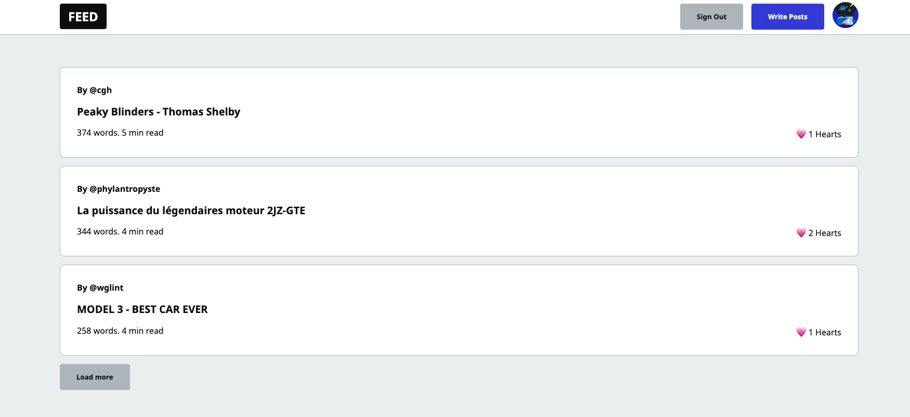

# Projet Next.js 13 and Firebase - Clone Dev.io

It's a clone of [Dev.io](https://dev.to/) website. With Fireship tutorial, this blog use SSR and Static Rendering for better performance.
Is you want to see [DEMO](https://devclone-three.vercel.app/).



## How it's work

In this website you can create account with OAuth Google and choice your unique username. On top of that, you can : 

- Create a post
- Like each other post
- Upload picture
- Preview your post with markdown type
- Publish or not your post 
- Logging with OAuth Google
...


For see more, go check yourself !

## How use this code.

First, create a firebase webapp for get yours apikey, authDomain... and write all firebaseConfig in `./lib/firebase.js` file :

```jsx
const firebaseConfig = {
    apiKey: "apikey",
    authDomain: "authDomain",
    projectId: "projectId",
    storageBucket: "storageBucket",
    messagingSenderId: "messagingSenderId",
    appId: "appId",
    measurementId: "measurementId"
}
```

After that, you can run following bash command :

```bash
npm i
npm run dev
# or
yarn add
yarn dev
# ou
pnpm i
pnpm dev
```

Open [http://localhost:3000](http://localhost:3000) link and have fun for check what can you do.

## Learn More

To learn more about all thing i use, take a look at the following resources:

- [Next.js Documentation](https://nextjs.org/docs) - learn about Next.js features and API.
- [React Documentation](https://react.dev/learn) - Front end client framework using with NextJS.
- [TailwindCSS Documentation](https://tailwindcss.com/docs/installation) - CSS Framework.
- [Vercel Documentation](https://vercel.com/docs) - Frontend cloud use for deployement and edge function.
- [Firebase Documentation](https://firebase.google.com/docs/guides?authuser=0&%3Bhl=fr&hl=fr) - NoSQL Database and OAuth.
